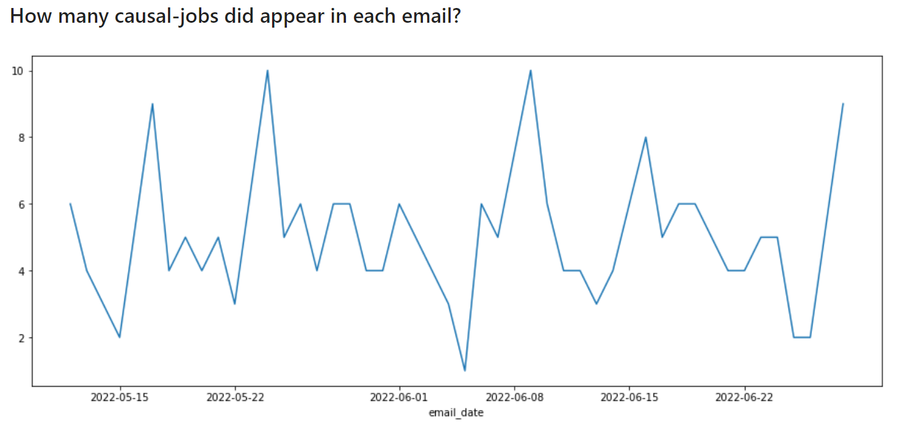
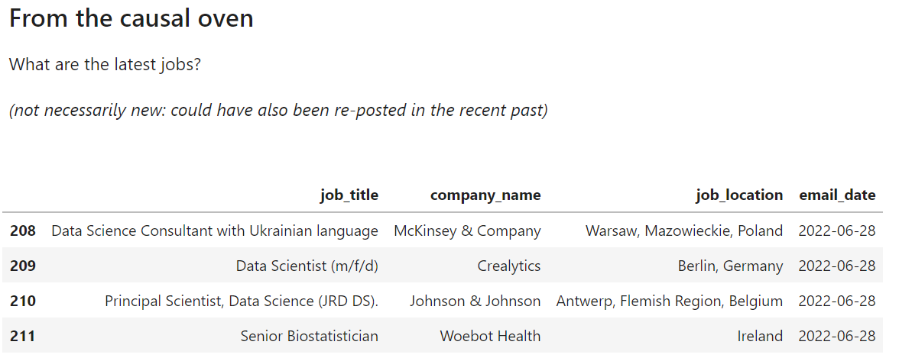

# Welcome to *causal-jobs*

---

Find the latest job report [here](https://github.com/ggiannarakis/causal-jobs/blob/main/Analysis.ipynb)

---

> *causal-jobs* is a jobs analytics project
> dedicated to revealing the status of
> **causal inference** in the European job market

---

It is based on automatically parsing job alert
emails generated by "causal inference" as a
search term. 

Since May 12, 2022, any job vacancy
that contains this term is extracted from the
corresponding email, transformed into an
analysis-ready dataframe, and loaded into a
postgresql database in a Docker container 
through a dedicated ETL pipeline that runs daily. 

Then, once a week a html report 
is automatically generated by 
analyzing the data. The report contains
the latest *causal-jobs* vacancies, as well as
company names, location data and other
relevant information.

---

## Architecture

---

## Report Sample

## Wordcloud from all *causal-jobs* titles

---

## Setup (TODO)