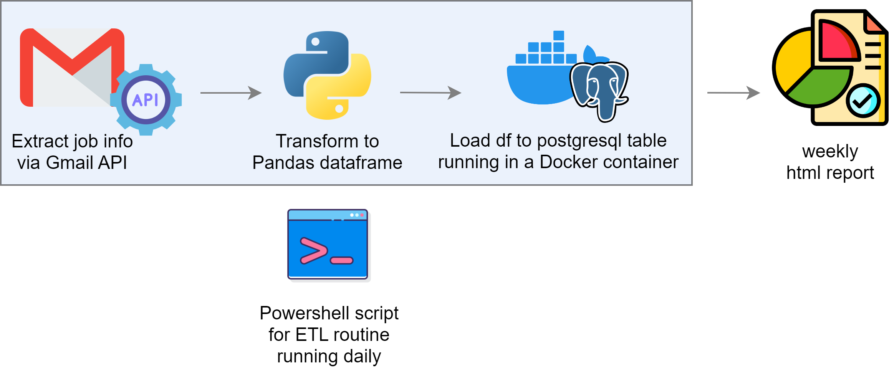
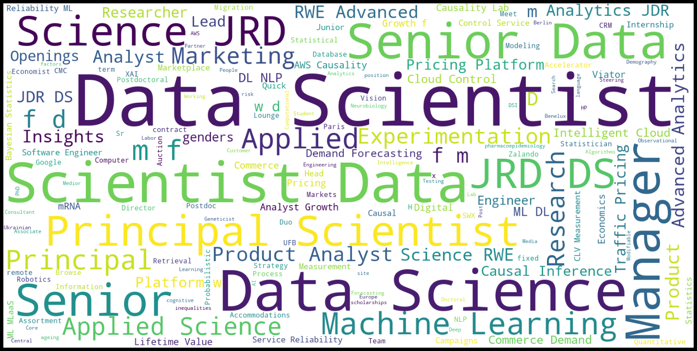

# Welcome to *causal-jobs*

---

Find the latest job report [here](https://ggiannarakis.github.io/causal-jobs/) (*updates every Tuesday*)

---

> *causal-jobs* is a jobs analytics project
> dedicated to revealing the status of
> **causal inference** in the European job market

---

It is based on automatically parsing job alert
emails generated by "causal inference" as a
search term. 

Since May 12, 2022, any job vacancy
that contains this term is extracted from the
corresponding email, transformed into an
analysis-ready dataframe, and loaded into a
postgresql database in a Docker container 
through a dedicated ETL pipeline that runs daily. 

Then, once a week a html report 
is automatically generated by 
analyzing the data. The report contains
the latest *causal-jobs* vacancies, as well as
company names, location data and other
relevant information.

---

## Architecture



---

## Wordcloud from all *causal-jobs* titles



---

## Setup

Below is a brief step-by-step guide in case you would like to
set up your own *causal-jobs* project, e.g. to change the analysis or
focus on another region / specific country.

### 0. Create the relevant job alert

Set up a daily job alert email message from LinkedIn
specifying search terms ("causal inference")
and location ("European Union"). Create a folder
and label it "causal-jobs". Finally, create a
[Gmail filter](https://support.google.com/a/users/answer/9308833?hl=en)
in order to automatically label the daily job alert
emails under the ```causal-jobs``` folder. This is where
the ```extract.py``` script will be looking for new
emails.


### 1. Set up the GmailAPI

Begin by setting up the 
[Gmail API](https://developers.google.com/gmail/api) 
to create a simple Python command-line application 
that makes requests. This is done through the
Google Cloud console. Make sure to complete the
OAuth consent screen and push the Gmail API app you
have created to production. Remember to put your
```credentials.json``` and ```token.json```
file on ```.gitignore```. The following links
will help:

- https://developers.google.com/gmail/api/quickstart/python
- https://www.geeksforgeeks.org/how-to-read-emails-from-gmail-using-gmail-api-in-python/

### 2. Create the Extract & Transform scripts

Develop an ```extract.py``` and a ```transform.py```
Python script (see mine or links above). The ```extract.py```
script requests the last job alert email(s)
and extracts it  from the ```causal-jobs``` 
folder of your Gmail via Python to local host. Then,
the ```transform.py``` script transforms it
into a Pandas dataframe where each row is a job 
that the email contains, and each column
contains info about it. Also, create a conda
virtual environment that you will be activating
before running any script (see ```requirements.txt```).

### 3. Create the database

A database is needed for saving the extracted and
transformed job alert emails and for the weekly
analysis to take place. For brevity, I
got a Docker PostgreSQL image from [Docker
Hub](https://hub.docker.com/_/postgres/) and used
pgAdmin 4 to create and manage the database. The
database only contains one table featuring the
*causal-jobs* and relevant information.

### 4. Create the Load script

Develop a ```load.py``` Python script (see mine).
The ```load.py``` initially executes the 
```extract.py``` and ```transform.py``` scripts, i.e.
retrieves the latest email as a Pandas dataframe
that's ready for insertion into the database. 
Then, it connects with the postgres database in
the running Docker container 
and performs the following actions:

* Retrieve the *causal-jobs* table containing all past emails
* If the ```email_id``` of the already retrieved latest email does not exist in the table append the data to it

### 5. Schedule the daily ETL routine

Create a PowerShell / Bash script that fires up
the ETL routine daily, performing all relevant actions
(see ```causal-jobs-powershell.ps1```, Widows in my case). Then using Task Scheduler / Cron set up a daily task
at a convenient time to execute the aforementioned script.
If you miss a day or two (e.g. due to localhost being offline)
you can always manually execute the task provided the
missing email is the last among the emails labeled
as *causal-jobs*.

### 6. Create the Analysis script

Develop a Python script that connects to the
postgres database of the running Docker container
and performs all sorts of 
*causal-jobs* analysis you would like
to see! See the ```Analysis.ipynb``` notebook 
for inspiration.

### 7. Schedule the weekly Analysis report & upload it

Just like #5, schedule a weekly PowerShell / Bash
script that executes the Jupyter notebook 
```Analysis.ipynb```, generating the weekly report.
The report is then extracted in 
html form via the command line.
Create a [Github page](https://pages.github.com/)
for your repo.
Finally, using the 
```causal-analysis-weekly-powershell.ps1```
script above, 
push the latest weekly report as ```index.html```
(required for Github page deployment)
from localhost to the Github repo. Your *causal-jobs*
report is
[live](https://ggiannarakis.github.io/causal-jobs/)!